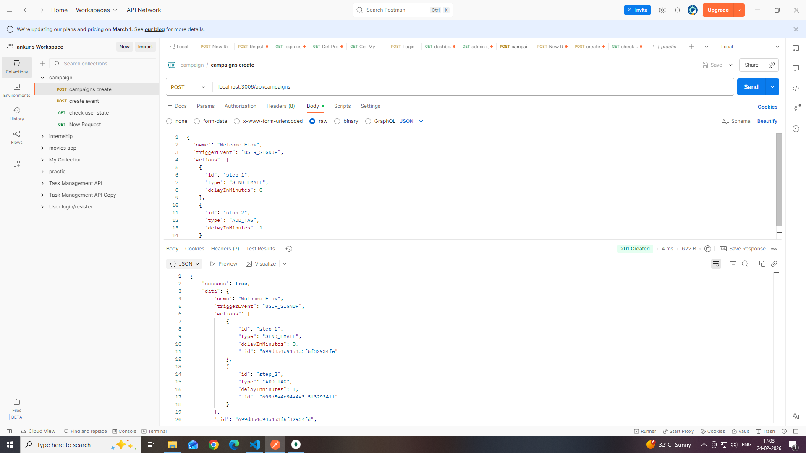
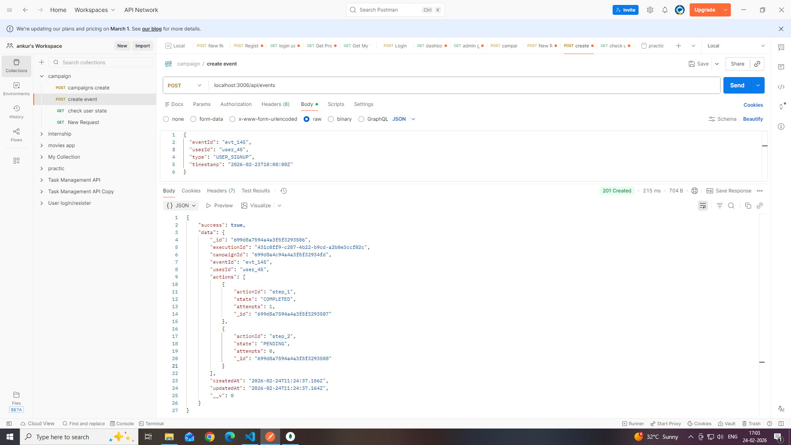
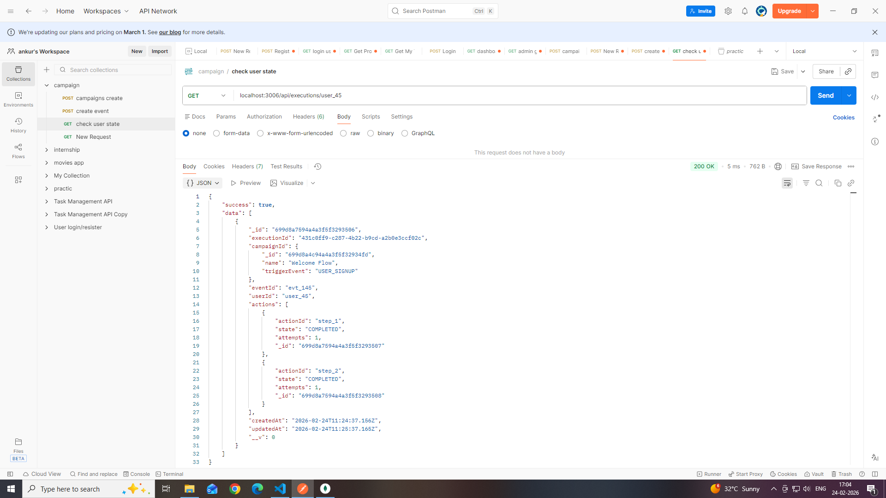

# Campaign Execution Engine

## Overview

This project is a simplified Campaign Execution Engine built using Node.js, Express, and MongoDB.

The system allows:

- Admin to create campaigns
- System to receive user events
- Automatic execution of campaign actions
- Execution state tracking
- Idempotent event handling
- Observability of executions
- Retry mechanism for failed actions (basic simulation)

---

## Tech Stack

- Node.js
- Express.js
- MongoDB (Mongoose)
- UUID
- Postman (for testing)

---

## Setup Instructions

1. Clone the repository

2. Install dependencies

npm install

3. Create `.env` file

PORT=3006  
DB_STRING=mongodb://localhost:27017/CampaignDB  
Env=development  

4. Start server

npm run dev

Server runs on:
http://localhost:3006

---

## API Endpoints

### 1️⃣ Create Campaign
POST /api/campaigns

Creates a campaign with:
- name
- triggerEvent
- actions (unique action IDs required)

---

### 2️⃣ Receive Event
POST /api/events

System:
- Validates input
- Ensures idempotency using unique eventId
- Matches campaign by triggerEvent
- Creates execution instance
- Starts async processing

---

### 3️⃣ Get Executions
GET /api/executions/:userId

Returns:
- All executions for the user
- Current state of actions

---

### 4️⃣ Retry Failed Actions
POST /api/executions/:executionId/retry

- Retries only FAILED actions
- Increments attempt count
- Simulates async reprocessing

---

## Idempotency Strategy

- `eventId` has unique index in MongoDB.
- Duplicate event creation throws error (11000).
- System catches it and returns existing execution.
- Prevents duplicate processing.

---

## Execution States

Each action can have:

- PENDING
- PROCESSING
- COMPLETED
- FAILED

Failure is simulated using random 20% failure logic.

---

## Limitations

- Uses setTimeout for async simulation (not production-grade).
- No real email integration.
- No distributed processing.
- Designed for learning and assignment scope.

---

## Scale Consideration

If system needs to handle 1M events per minute:

- Replace setTimeout with message queue (Kafka/RabbitMQ).
- Introduce background worker processes.
- Add Redis for distributed locking.
- Add structured logging and monitoring.

---

## Design Focus

- Clean separation (Domain → Services → Controllers → Routes)
- Idempotency safety
- Retry logic
- Clear execution tracking
- Basic failure handling

  ---

  ## API Testing Screenshots

### Create Campaign

### Trigger Event

### Execution Status

